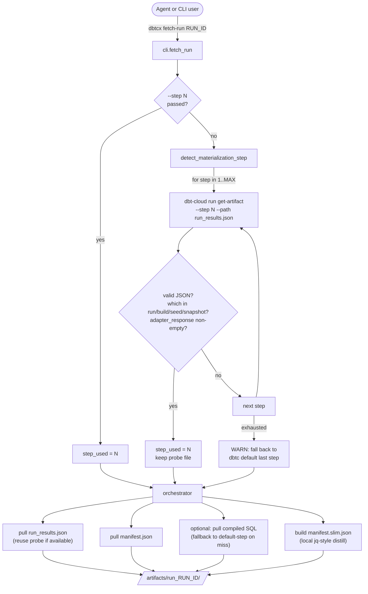

# v0.1.0 — Initial release: solve the multi-step-job artifact trap

## TL;DR

`dbt-cloud-cli` pulls artifacts from the **last** step of a run by default. For any production dbt Cloud job that ends with `dbt docs generate` (which is almost all of them), that means `run_results.json` comes back with empty `adapter_response` on every row — useless for warehouse diagnostics. `dbtcx fetch-run` probes the run's steps and pulls from the materialization step automatically, so `adapter_response.job_id` / `slot_ms` / `bytes_processed` are populated for downstream tooling and agents.

## Why this release exists

`dbt-cloud-cli` exposes `dbt-cloud run get-artifact --run-id N --path run_results.json`. Two undocumented behaviors collide:

1. The CLI defaults `--step` to the run's **last** step.
2. Most production jobs end with `dbt docs generate` — a compile-only step that emits `run_results.json` with `adapter_response: {}` on every row.

So agents and humans asking the obvious question — *"give me the BigQuery / Snowflake / Redshift job ID for this model so I can look at its query plan"* — get an empty object back, with no error and no hint that they pulled the wrong step. The fix isn't subtle (pass `--step N`), but you have to know N, which means walking the run's steps until you find the one whose `args.which` is in `{run, build, seed, snapshot}` AND has non-empty `adapter_response` on at least one result.

Doing that walk manually is a tax that gets paid every time a new agent / new run / new project encounters the issue. This package collapses it to one call.

## Highlights

| Change | What it does | Why it matters |
|---|---|---|
| `dbtcx fetch-run <run_id>` | Auto-detects the materialization step, pulls `run_results.json` + `manifest.json` + slim manifest into `artifacts/run_<id>/` | Single command yields populated `adapter_response` — agents stop burning round-trips on step discovery |
| `--step N` override | Skip auto-detect, pull from the step you specify | Escape hatch for unusual job shapes |
| `--model-path PATH` | Also pull that model's compiled SQL; falls back to default-step if not in the materialization bundle | dbt Cloud bundles `compiled/*.sql` into the docs-generate step, not the run step — the fallback is needed |
| `--force` | Re-download even when files exist | Otherwise the command is idempotent: re-runs skip existing artifacts |
| `manifest.slim.json` | Distills `manifest.json` to node deps + materialization + schema (no compiled SQL bodies) | Cheap for LLMs to slurp into context |
| `dbtcx proxy <args>` | Pass-through to `dbt-cloud` with `.env` already loaded | Removes the wrapper-script boilerplate from every project that uses dbt-cloud-cli |
| `.step_used` marker | Records which step produced the local artifacts; auto-clears stale files when the resolved step changes between runs | Prevents mixing step-specific artifacts silently |

## How it works



## Before / After

A coding agent diagnosing a slow model in v_prev (raw `dbt-cloud-cli` only):

```
> dbt-cloud run get-artifact --run-id 12345678 --path run_results.json -f out.json
> jq '.results[] | select(.unique_id == "model.demo.my_model") | .adapter_response' out.json
{}
> # ...empty. Now what? Was that step 1? Step 7? Time to walk steps manually...
> dbt-cloud run get-artifact --run-id 12345678 --step 1 --path run_results.json -f s1.json
Not found.
> dbt-cloud run get-artifact --run-id 12345678 --step 2 --path run_results.json -f s2.json
Not found.
> # ...four more rounds, then finally:
> dbt-cloud run get-artifact --run-id 12345678 --step 4 --path run_results.json -f s4.json
> jq '.results[] | select(.unique_id == "model.demo.my_model") | .adapter_response.job_id' s4.json
"bq-job-abc123"
```

Same task in v0.1.0:

```
> dbtcx fetch-run 12345678
== auto-detecting materialization step (probe 1..15) ==
  [step 1] no run_results.json (404 or non-dbt step), skipping
  [step 2] no run_results.json (404 or non-dbt step), skipping
  [step 3] no run_results.json (404 or non-dbt step), skipping
  [step 4] which=run, results_with_adapter_response=56
== auto-detected step: 4 ==
== fetch-run 12345678 -> artifacts/run_12345678 ==
  [pull] run_results.json ... ok (216K) [from probe]
  [pull] manifest.json ... ok (8.4M)
  [slim] manifest.slim.json ... ok (412K)
== done ==
step_used=4
> jq '.results[] | select(.unique_id == "model.demo.my_model") | .adapter_response.job_id' artifacts/run_12345678/run_results.json
"bq-job-abc123"
```

One call, populated `adapter_response`, logs that tell the agent exactly which step won and why.

## Configuration

Environment variables (loaded from `.env` in the working directory by default; override with `--env-file PATH`):

| Var | Required | Notes |
|---|---|---|
| `DBT_CLOUD_API_TOKEN` | yes | Service token (`dbtu_...`) from dbt Cloud → Settings → API Tokens |
| `DBT_CLOUD_ACCOUNT_ID` | yes | Numeric account ID |
| `DBT_CLOUD_HOST` | yes | **Bare hostname only** — no `https://`. Multi-tenant US: `cloud.getdbt.com`; single-tenant: `<prefix>.us1.dbt.com`; EMEA: `emea.dbt.com`; AU: `au.dbt.com` |
| `DBT_CLOUD_READONLY` | no | When `true`, `dbt-cloud-cli` suppresses destructive subcommands |

## Upgrade notes

First release — nothing to migrate from. If you're coming from a hand-rolled bash wrapper that did the same step-probe trick (this package is a Python port of exactly that wrapper), the behavior is 1:1. Notable parity points:

- Same auto-detect predicate: `args.which ∈ {run, build, seed, snapshot}` AND ≥1 non-empty `adapter_response`.
- Same fallback for compiled SQL (retry without `--step` on miss).
- Same `.step_used` marker semantics — step-change between invocations wipes stale artifacts.
- Same idempotence — re-runs skip existing files unless `--force`.

## Files in this release

```
src/dbtcx/__init__.py        # package metadata + __version__
src/dbtcx/cli.py             # click group: main / fetch-run / proxy
src/dbtcx/fetch_run.py       # probe + fetch + slim manifest orchestrator
tests/test_fetch_run.py      # mocked-subprocess coverage of probe / fallback / step-change
.github/workflows/release.yaml  # OIDC PyPI publish + narrative GitHub Release
pyproject.toml               # hatchling build, depends on dbt-cloud-cli + click + python-dotenv
README.md                    # value prop + quickstart
LICENSE                      # MIT
.env.example                 # config template, no secrets
.gitignore                   # gates .env / artifacts / build outputs
releases/v0.1.0.md           # this file
releases/README.md           # narrative-release index
```

## Acknowledgements

Wraps [`dbt-cloud-cli`](https://github.com/data-mie/dbt-cloud-cli) by data-mie. This package adds the multi-step-aware fetcher plus a thin env-loader pass-through; everything else delegates to the upstream CLI.
