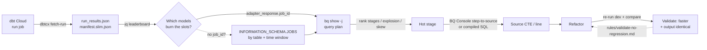

# dbt-bq-optimize

Diagnose and speed up dbt models by joining two CLIs you run from your shell:

| Tool | Gives you | One-liner |
|---|---|---|
| **`dbtcx`** | dbt Cloud run artifacts — `run_results.json` (per-model `adapter_response.job_id` + `slot_ms` + `bytes_processed`), `manifest.json`, slim manifest | `uvx dbtcx fetch-run <RUN_ID>` |
| **`bq`** | The warehouse's own truth — query plan stages, slot/byte/skew metrics, `INFORMATION_SCHEMA.JOBS` performance insights | `bq ... show -j <BQ_JOB_ID>` |

**The synergy:** `dbtcx` hands you the BigQuery `job_id` for each model in a run (dbt itself never logs it). `bq` turns that `job_id` into a stage-by-stage cost breakdown. Together they take you from "this run is slow" → "stage S65 fans out 31M rows to 56B because of a range-join on line 282" without guessing.

> **Shell vocab:** this doc speaks **bash** — run every command in your terminal (or your agent's `bash` tool). If you happen to operate through an MCP filesystem proxy, route the same string through your shell-exec tool; the commands are byte-identical either way.

## When to use

- "Why is `<model>` slow?" / "Speed up the models in run job `<job>`."
- A run job's wall time is dominated by one or a few models and you need the bottleneck stage.
- You changed a model for performance and must prove the output is still bit-identical (see `rules/validate-no-regression.md`).

Skip for non-dbt SQL tuning, or when you already have the BQ job_id and just want the plan — jump straight to `rules/bq-plan-analyze.md`.

## One-time setup

### 1. `dbtcx` (zero-install via uv)

`dbtcx` is an agent-friendly wrapper over `dbt-cloud-cli` that solves the multi-step-job artifact trap: production jobs end with `dbt docs generate`, so a naive artifact pull returns `adapter_response: {}` (no job_id, no slot_ms). `dbtcx fetch-run` probes steps until it finds the actual `run`/`build` step and pulls artifacts from there.

Repo + full docs: **https://github.com/luutuankiet/dbtcx**

```bash
uvx dbtcx fetch-run 12345678          # zero-install: uv runs it from PyPI in an ephemeral cache
# or install it on PATH:
uv tool install dbtcx                 # then just: dbtcx fetch-run 12345678
```

Configure once — `.env` is auto-loaded from the current working directory (use `--env-file PATH` to point elsewhere):

```bash
cat > .env <<'EOF'
DBT_CLOUD_API_TOKEN=dbtu_xxxxxxxx          # dbt Cloud → Settings → API Tokens
DBT_CLOUD_ACCOUNT_ID=12345                # numeric, from the URL after /accounts/
DBT_CLOUD_HOST=cloud.getdbt.com           # BARE hostname, no https:// (single-tenant: <prefix>.us1.dbt.com)
EOF
```

Full config table (host variants, readonly flag): see the repo README → "Configuration reference".

### 2. `bq` (BigQuery CLI)

Authenticate once and pin the project + region. **Region must match your dataset region** (`EU` vs `US`) or queries fail silently / cross-region.

```bash
gcloud auth login --update-adc                 # or: gcloud auth application-default login
export BQ_PROJECT=your-warehouse-prod          # GCP project that owns the dbt datasets
export BQ_LOCATION=EU                           # EU or US — match your warehouse region
bq --project_id=$BQ_PROJECT --location=$BQ_LOCATION query --use_legacy_sql=false 'SELECT 1'   # smoke test
```

## The end-to-end loop



### Step 1 — find the run for the job (bash)

```bash
# Newest runs for a job. NOTE: default sort is ASC (ancient runs) — always pass --order-by '-id'.
uvx dbtcx proxy run list --job-id <JOB_ID> --order-by '-id' --limit 10 \
  | jq -r '.data[] | [.id, .status_humanized, .duration_humanized, .created_at[:19]] | @tsv'
```

### Step 2 — pull artifacts (bash)

```bash
uvx dbtcx fetch-run <RUN_ID>
# → ./artifacts/run_<RUN_ID>/{run_results.json, manifest.json, manifest.slim.json, .step_used}
# add --model-path 'compiled/<project>/models/.../<model>.sql' to also bundle compiled SQL
```

### Step 3 — build the model leaderboard (bash)

The key payoff: `run_results.json` already carries the BigQuery `job_id` per model. Rank the group by slot_ms and read off the job_id to feed `bq` — no time-window guessing.

```bash
jq -r '.results[]
        | select(.unique_id | startswith("model."))
        | [ (.adapter_response.slot_ms // 0),
            (.execution_time | floor),
            (.adapter_response.bytes_processed // 0),
            (.adapter_response.job_id // "-"),
            .unique_id ]
        | @tsv' artifacts/run_<RUN_ID>/run_results.json \
  | sort -rn | head -20
# columns: slot_ms | exec_sec | bytes | BQ_JOB_ID | model
```

The top row(s) are your optimization targets. Grab the `BQ_JOB_ID`.

### Step 4 — turn the job_id into a query plan (bash)

```bash
bq --project_id=$BQ_PROJECT --location=$BQ_LOCATION show --format=prettyjson \
   -j '<BQ_JOB_ID>' > /tmp/job.json
```

Then analyze it → **`rules/bq-plan-analyze.md`** (header summary, top-N hot stages, record-explosion detector, skew detector, performance-insight tooltips, stage→source mapping).

### Step 4b — fallback: no job_id on disk (bash)

For a model you didn't pull (e.g. comparing against the live prod build), find its BQ job directly from `INFORMATION_SCHEMA.JOBS_BY_PROJECT` by destination table + time window. Generalize this template — swap the placeholders:

```bash
bq --project_id=$BQ_PROJECT --location=$BQ_LOCATION query --use_legacy_sql=false \
   --format=prettyjson --max_rows=5 \
  "SELECT job_id, statement_type, total_slot_ms, total_bytes_processed,
          TIMESTAMP_DIFF(end_time, start_time, SECOND) AS wall_sec,
          destination_table.dataset_id, destination_table.table_id
   FROM \`$BQ_PROJECT.region-eu.INFORMATION_SCHEMA.JOBS_BY_PROJECT\`
   WHERE creation_time BETWEEN TIMESTAMP('2026-01-01 00:00:00 UTC')
                           AND TIMESTAMP('2026-01-01 06:00:00 UTC')
     AND destination_table.table_id = '<TABLE>'
   ORDER BY total_slot_ms DESC LIMIT 5"
```

> The region qualifier `region-eu` in the FROM clause is a **literal** (`region-eu` / `region-us`) and must match `$BQ_LOCATION`. It is NOT the `$BQ_PROJECT.<dataset>` form.

### Step 5 — map the hot stage to source, refactor, re-measure

Decode the hot stage to a source CTE (BQ Console's Query Visualization has native step→source line mapping — prefer it over grepping compiled SQL). Refactor, re-run the model in dev, pull its new BQ job, and diff `slot_ms` / `wall` / `bytes` / `rows`. Before shipping, prove the output is unchanged → **`rules/validate-no-regression.md`**.

## Gotchas

- **`DBT_CLOUD_HOST` is a bare hostname** — `cloud.getdbt.com`, never `https://...`. A scheme makes every call fail with a `host='https'` DNS error.
- **`dbtcx proxy run list` default sort is ASC** — returns year-old runs. Always `--order-by '-id'`.
- **`adapter_response` is empty on docs-generate steps** — `dbtcx fetch-run` already routes around this; if you call `dbt-cloud-cli` directly you'll hit it.
- **BQ region literal vs project.dataset** — `INFORMATION_SCHEMA.JOBS_BY_PROJECT` lives under `\`<project>\`.\`region-eu\`...`, not under a dataset. Mismatched region returns zero rows, no error.
- **slot_ms ≫ wall_sec means a skewed single slot**, not just "a lot of work" — the skew detector in `rules/bq-plan-analyze.md` finds the offending stage.
- **Performance is compute, not scan** when a model processes far fewer bytes than peers yet runs 100× longer — the cause is join/explosion/skew, never scan size. Don't chase partition filters first.
